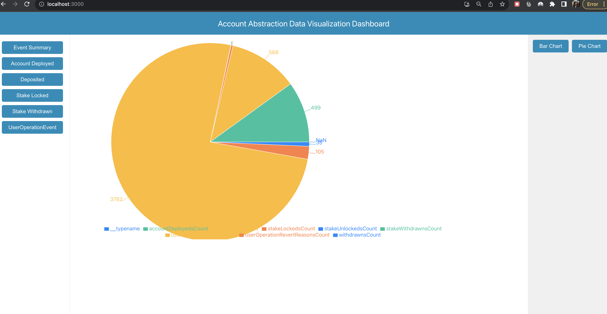
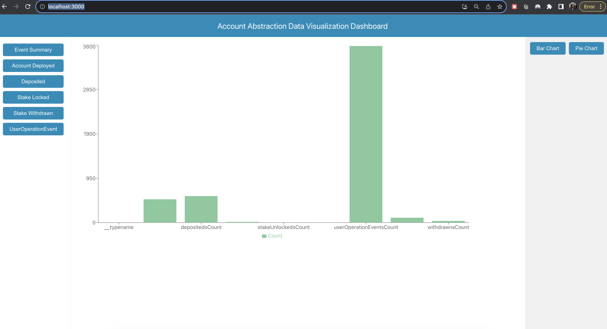

# Account Abstraction Data Visualisation Using Envio

This repo does some visualisation of data related to Account Abstraction (0x5FF137D4b0FDCD49DcA30c7CF57E578a026d2789) in Ethereum mainnet. 

The data is gotten using envio in a local docker and it is plotted using React.

Etherscan of the smart contract: https://etherscan.io/address/0x5FF137D4b0FDCD49DcA30c7CF57E578a026d2789

## Chalenges

I helped found a potential bug in the current setup in envio which expected all events to have some arguments which was not the case for one of the events on the smart contract I was interested in.